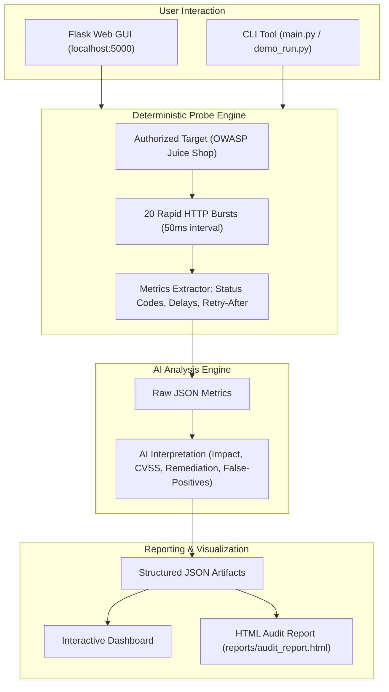

<div align="center">

# 🛡️ BruteShield-AI
### AI-Assisted Rate Limiting & Brute-Force Exposure Vulnerability Analysis Tool
**Automated Security Probing &bull; LLM-Powered Threat Analysis &bull; Interactive Dashboard &bull; Exportable Audit Reports**

[](https://www.python.org/)
[](https://flask.palletsprojects.com/)
[](https://cwe.mitre.org/data/definitions/307.html)
[](https://github.com/muhammadabdullah-devpk)
[](LICENSE)

<br>

<p align="center">
  <a href="#-overview">Overview</a> •
  <a href="#-key-features">Key Features</a> •
  <a href="#-system-architecture">Architecture</a> •
  <a href="#-installation--usage">Quickstart</a> •
  <a href="#-interactive-dashboard">Dashboard & Reports</a> •
  <a href="#-testing--validation">Test Results</a> •
  <a href="#-limitations--ethical-disclosure">Limitations & Ethics</a> •
  <a href="#-author">Author</a>
</p>

</div>

---

## 📌 Overview

In modern web ecosystems—particularly **Lifestyle & Health Applications** storing user biometrics, activity logs, private habits, and payment profiles—authentication and form endpoints are prime targets for automated attacks (credential stuffing, account takeovers, password brute-forcing, and resource exhaustion).

**BruteShield-AI** is a dual-tier vulnerability detection and remediation system developed for **SAFEX Internship (AI/ML Track — Week 4)**. It bridges the gap between raw programmatic security scanning and contextual artificial intelligence interpretation:

1. **Deterministic Probing Engine:** Sends calibrated bursts of 20 rapid requests per target endpoint to log precise HTTP status codes, latency deltas, and `Retry-After` headers.
2. **AI-Assisted Threat Synthesis:** Evaluates raw execution logs to establish real-world threat vectors, calculate CVSS risk scores, evaluate false-positive probability, and generate defensive remediation guidelines.
3. **Strict Facts vs. AI Separation:** Strictly demarcates deterministic automated facts from probabilistic AI judgments to maintain full analytical transparency.

---

## 🚀 Key Features

* **⚡ Automated 20-Burst Concurrency Testing:** Simulates rapid automated request flooding against login, password reset, registration, and feedback routes.
* **🛡️ HTTP Status Code & Header Tracking:** Observes HTTP `200 OK` vs. `429 Too Many Requests`, identifying presence or absence of standard throttling headers (`Retry-After`, `X-RateLimit-*`).
* **🧠 Context-Aware AI Analysis:** Generates evidence breakdowns, real-world attack scenarios, and structured multi-layered defensive recommendations (WAF, Token Bucket, Exponential Backoff, CAPTCHA).
* **🔬 Rigorous False-Positive Validation:** Incorporates a patched search endpoint acting as a baseline control to ensure the scanner does not flag correctly throttled APIs as vulnerable.
* **💻 Interactive Cyber Dark Dashboard:** Built with Flask, featuring a high-contrast cyber theme, live scanning triggers, methodology documentation, and quality checklists.
* **📄 Self-Contained Audit Reports:** Generates publication-ready HTML reports detailing findings, endpoint facts, and AI remediation strategies.

---

## 🏗️ System Architecture



---

## 📊 Automated Facts vs. AI Interpretation (Separation of Concerns)

A foundational architectural requirement of this tool is **strict transparency**:

| Component | Automated Script Output (Facts) | AI-Assisted Output (Interpretation) |
|---|---|---|
| **Nature** | 100% Deterministic & Verifiable | Contextual & Probabilistic |
| **Data Points** | Total requests (20), Status codes (`[200]`, `[429]`), `Retry-After` presence, Avg latency (ms) | Real-world business impact, Attack feasibility, CVSS calculation |
| **Trust Model** | Direct network measurements | Advisory guidance requiring human analyst review |
| **Presentation** | Green/Red numerical indicators, raw status code pills | Labeled with `⚠ AI-ASSISTED — VERIFY MANUALLY` warnings |

---

## 🧪 Testing & Validation Matrix

Tested against authorized lab targets (**OWASP Juice Shop**):

| # | Target Endpoint | Context | HTTP Sequence | Throttled? | Verdict | Severity |
|:---:|---|---|:---:|:---:|:---:|:---:|
| 1 | `/rest/user/login` | Lifestyle App — User Login | 20x `200` | ❌ No | **VULNERABLE** | **High (7.5)** |
| 2 | `/rest/user/reset-password` | Lifestyle App — Password Recovery | 20x `200` | ❌ No | **VULNERABLE** | **High (8.1)** |
| 3 | `/rest/products/search` | Lifestyle App — Product Search | 13x `200`, 7x `429` | ✅ Yes | **PROTECTED** | **None (0.0)** *(Control Test)* |
| 4 | `/api/Feedbacks` | Lifestyle App — Customer Feedback | 20x `200` | ❌ No | **VULNERABLE** | **Medium (6.5)** |
| 5 | `/api/Users` | Lifestyle App — New Account Creation | 20x `200` | ❌ No | **VULNERABLE** | **High (7.3)** |

> *Endpoint #3 serves as the **False-Positive control**, confirming that endpoints enforcing HTTP 429 and `Retry-After` are correctly identified as safe.*

---

## 💻 Installation & Usage

### 1. Clone the Repository
```bash
git clone https://github.com/muhammadabdullah-devpk/BruteShield-AI.git
cd BruteShield-AI
```

### 2. Create and Activate Virtual Environment (Recommended)
```bash
# Windows
python -m venv venv
venv\Scripts\activate

# Linux / macOS
python3 -m venv venv
source venv/bin/activate
```

### 3. Install Dependencies
```bash
pip install -r requirements.txt
```

### 4. Run the Web Application
```bash
python app.py
```
Open your browser and navigate to:
```text
http://127.0.0.1:5000/
```

### 5. Run via CLI (Headless Mode)
If you prefer running scans directly from the terminal without the web GUI:
```bash
python main.py
```
Audit reports will be generated in `reports/audit_report.html` and `reports/analyzed_results.json`.

---

## 📁 Repository Structure

```text
BruteShield-AI/
├── app.py                     # Flask web app & interactive dashboard
├── main.py                    # CLI pipeline runner
├── demo_run.py                # Standalone demo & validation script
├── requirements.txt           # Python package dependencies
├── .gitignore                 # Standard Python gitignore
├── README.md                  # Comprehensive documentation
├── tool/
│   ├── __init__.py            # Module initialization
│   ├── config.py              # Test targets, thresholds & delays
│   ├── scanner.py             # HTTP 20-burst probe engine
│   ├── ai_analyzer.py         # AI structured prompt & response parser
│   └── report_generator.py    # HTML audit report generator
├── docs/
│   └── limitations.md         # Documented edge cases & limitations
└── reports/
    ├── raw_results.json       # Deterministic script scan output
    ├── analyzed_results.json  # Combined script facts + AI analysis
    └── audit_report.html      # Production-grade HTML audit report
```

---

## ⚠️ Limitations & Ethical Disclosure

### Known Tool Boundaries (See [docs/limitations.md](docs/limitations.md))
1. **CDN / WAF Masking:** If rate limits are enforced at the Cloudflare or AWS WAF edge, origins may return 200 while edge blocks real traffic (false-negative potential).
2. **IP Rotation:** This tool executes tests from a single source IP. Distributed brute-force attacks utilizing proxy pools require distributed testing architecture.
3. **Session vs. IP Limits:** Only IP-based rate limiting is tested. Token/Cookie-based throttles require authenticated state handling.
4. **Human-in-the-Loop:** All AI evaluations must be validated by a security professional before operational deployment.

### Ethical Testing Notice
> **All testing was conducted strictly on authorized, intentionally vulnerable lab environments (OWASP Juice Shop demo instance). No unauthorized live production systems were probed. This repository is intended strictly for educational and defensive auditing purposes.**

---

## 👨‍💻 Author

<div align="center">


### **Muhammad Abdullah**
*AI/ML &amp; Cybersecurity Developer*  
**Lahore Garrison University — BSCS 6th Semester**  
**SAFEX Internship — AI/ML Track (Group 3)**  

[](https://github.com/muhammadabdullah-devpk)
[](https://github.com/muhammadabdullah-devpk/BruteShield-AI)

</div>

---

## 📄 License

This project is licensed under the [MIT License](LICENSE).
